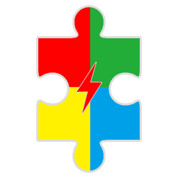
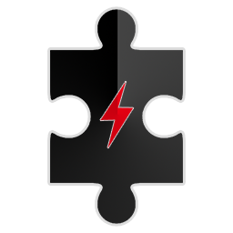
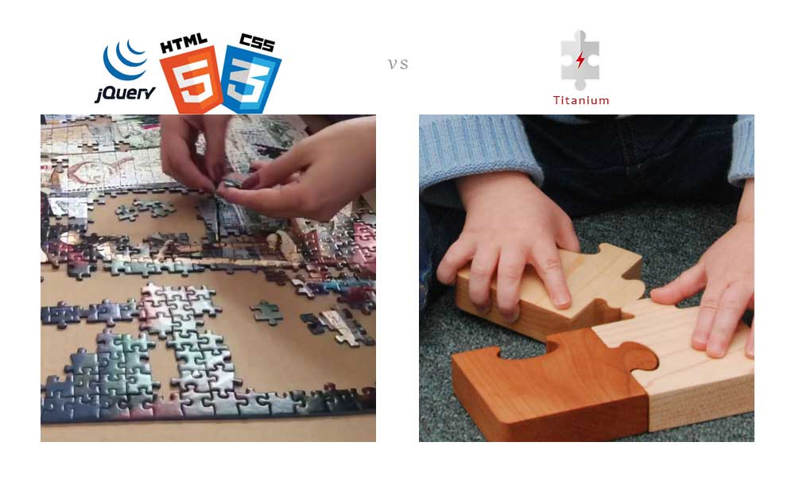
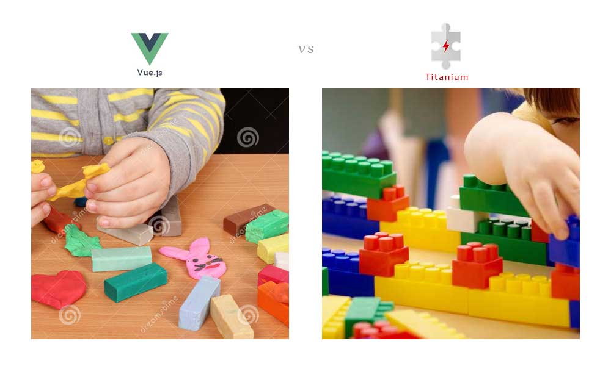
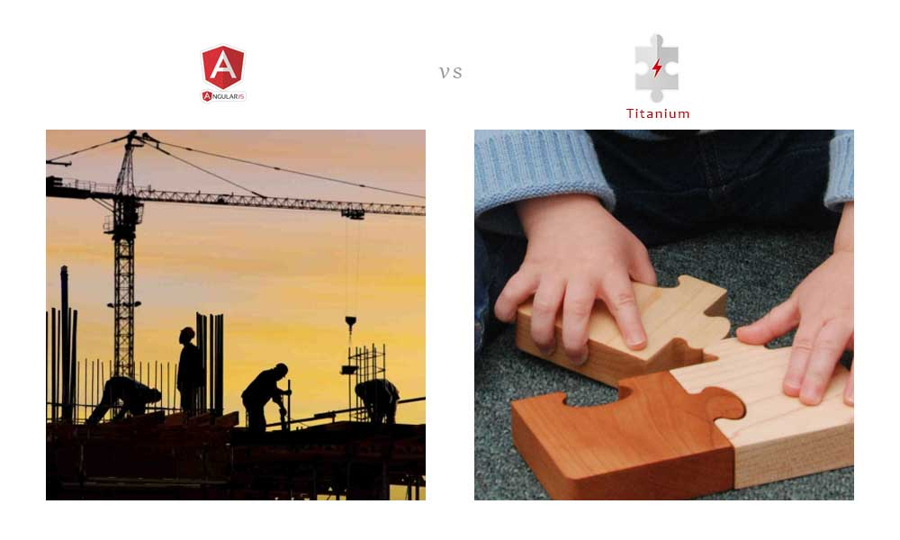
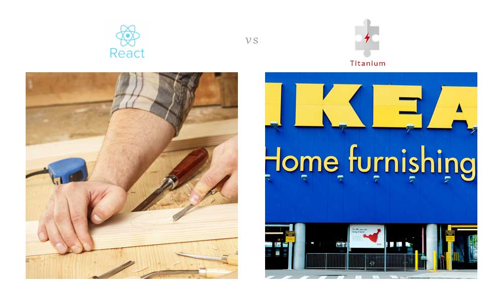

# What is Titanium


> A UI library, which design for you(The Frontend Programmer) to enhance your performance of GUI building job as much as you can.

-----------------------------------

Nutz | Gray | Color | Black
-----|------|-------|----------
 |  | | 


# Why Tiganium



---------------------------



---------------------------



---------------------------



---------------------------

```
对于前端编程，写个JS的核心框架，不是个太花力气的活计，
真正帮你节省力气的，是一个完善的界面组件库，
同时组件的组合方式最好让你愉悦，至少不能让你蛋疼。

这个库也必须允许你任意扩展你的组件
你的组件必须与库的核心组件享受同等的权利

我找遍了互联网，没有发现这样的库，于是我打算自己从头写一个，
现在把它开放给你使用，希望你能和我一样
通过这个库，彻底远离前端编程的诸多烦恼
诸位，玩的开心 ^_^
```
