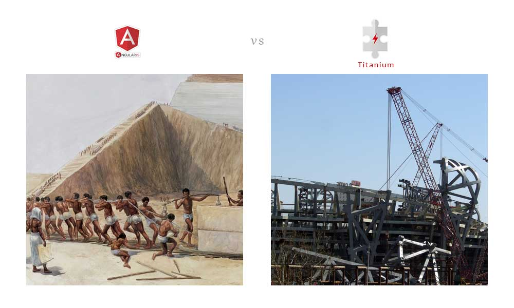

# What is Titanium


> A UI library, which design for you(The Frontend Programmer) to enhance your performance of GUI building job as much as you can.

-----------------------------------

Nutz | Gray | Color | Black
-----|------|-------|----------
 |  | | 


# Why Tiganium


---------------------------


---------------------------



---------------------------


---------------------------

我希望有这样一个 UI 库：

1. 同时支持手机和PC两种尺寸的屏幕
2. 组件齐全便于扩展
3. 对于 IDE 友好

我找遍了互联网，没有发现这样的库，于是我打算自己从头写一个：

1. 我了提供上百种控件，每个控件都有精心的设计
   - 其中一部分是专门设计给 PC 屏幕的
   - 另外一部分是专门设计给手机屏幕的
   - 还有一些是两者兼容的
2. 控件的配置主要采用 JSON 的方式：
   - 这样控件的组合与配置，我将来会比较容易提供一个图形化的界面，以便把开发成本降到最低
   - 通过内置的`动态字典`以及`配置扩展语法`，可以让JSON具有更灵活的扩展性，譬如表单项的自动隐藏等
3. 在`Ti.`名称空间内，内置了很多`lodash.js`之外的便捷函数，譬如
   - 对于路径字符串的操作
   - 国际化（`i18n`）的支持
   - 替代了 `axios` 的 `http` 客户端方法库
   - 时间/颜色等特殊数据结构的解析和输出
   - 矩形计算
   - 等等

我给它起名为`Titanium`，现在把它开放给你使用，希望你能和我一样
通过这个库，彻底远离前端编程的诸多烦恼
诸位，玩的开心 ^_^

# 项目文件布局

```bash
./titanium/
#-----------------------------------------
# 文档目录
|-- doc/
#-----------------------------------------
# 源码
|-- src/
|   |-- app/             # 嵌入Walnut的应用入口
|   |-- com/             # 控件库
|   |   |-- net/         # 与第三方云平台的接口控件）
|   |   |-- ti/          # 通用控件（主要针对PC)
|   |   |-- web/         # 针对手机和PC都兼容的网站控件
|   |   |-- wn/          # 专门为 Walnut 设计的控件
|   |-- core/            # 核心库
|   |-- deps/            # 依赖库
|   |-- dist/            # 发布目标
|   |-- i18n/            # 国际化字符串
|   |-- icons/           # 内置图标
|   |-- lib/             # 扩展库
|   |-- mod/             # Vuex 模块
|   |-- test/            # 控件测试代码
|   |-- theme/           # 内置主题
|   |-- view/            # 嵌入Walnut的视图配置
|   |-- ti-build.json    # 自定义打包配置
#-----------------------------------------
# 工具
|-- tools/
```

# 核心库布局

```bash
./titanium/src/core
|-- be/                       # 扩展行为
|-- vue/                      # 针对 Vue 的扩展
|-- widget/                   # 扩展小器件
|-- algorithm.mjs             # 算法：如sha1签名，求公倍数等
|-- api-facebook.mjs          # 【草稿】对于 Facebook API 的特殊封装
|-- app-action-shortcuts.mjs  # 应用快捷键帮助类
|-- app-info.mjs              # 应用配置加载逻辑
|-- app-modal.mjs             # 通用模态框
|-- app.mjs                   # 定义一个 Ti App 
|-- automatch.mjs             # 自动匹配算法
|-- bank.mjs                  # 货币相关的帮助函数
|-- behaviors.mjs             # 全局嵌入式功能，譬如 editId, blinkIt 等
|-- config.mjs                # Ti App 配置类，主要是封装了资源路由的解析方式
|-- css.mjs                   # CSS 字符串解析和渲染的相关帮助函数
|-- datetime.mjs              # 日期时间帮助函数
|-- dict.mjs                  # 字典机制
|-- dom.mjs                   # 封装了 DOM 操作，以便 jQuery Free
|-- err.mjs                   # 通用错误对象
|-- fuse.mjs                  # 引信机制
|-- gis.mjs                   # 地理信息计算（譬如火星坐标系转换等）
|-- gps.mjs                   # 【废弃】地理信息计算（譬如各个坐标系的转行） 
|-- http.mjs                  # Http 客户端（类似 axios.js）
|-- i18n.mjs                  # 国际化支持
|-- icons.mjs                 # 图标语义支持
|-- load.mjs                  # 资源加载器（类似 require.js 或者 sea.js）
|-- mapping.mjs               # 资源映射算法
|-- num.mjs                   # 数字计算帮助函数 
|-- polyfill-dynamic-import.mjs  # 对于 dynamic import 草案的胶水代码
|-- polyfill-ti-vue.mjs          # 对于 Vue 支持的胶水代码
|-- random.mjs                # 随机函数
|-- rect.mjs                  # 矩形计算函数。包括矩形对象的剪裁位移坐标变换等
|-- shortcut.mjs              # 系统快捷键支持
|-- storage.mjs               # 系统本地存储帮助函数
|-- str.mjs                   # 字符串操作帮助函数
|-- ti-alert.mjs              # 提示框
|-- ti-captcha.mjs            # 验证码框
|-- ti-confirm.mjs            # 确认框
|-- ti-prompt.mjs             # 提示框
|-- ti-runtime-stack.mjs      # 应用实例堆栈管理器
|-- ti-toast.mjs              # 消息框
|-- ti-walnut-app-main.mjs    # 对于 Walnut 应用的入口函数
|-- ti-web-app-main.mjs       # 对于普通 Web 站点的入口函数
|-- ti.mjs                    # 定义 Ti 名称空间
|-- trees.mjs                 # 普通JS对象树型遍历操作
|-- types.mjs                 # 数据类型转换
|-- util-link.mjs             # 通用帮助函数：链接相关
|-- util-paths.mjs            # 通用帮助函数：路径相关
|-- util.mjs                  # 通用帮助函数
|-- validate.mjs              # 【废弃】验证帮助函数（现在由 automatch.mjs代替）
|-- viewport.mjs              # 窗口行为检测框架
|-- websocket.mjs             # 对于 websockt 的支持
|-- www.mjs                   # 对于 Walnut Web 站点的帮助函数
```

