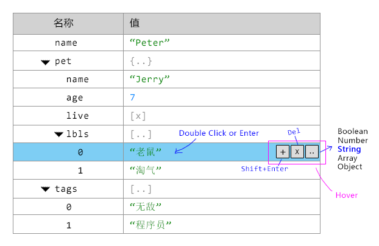

-------------------------------------------------------------------
# ObjJsonTree Overview

`<ti-obj-json-tree>` can:

- Edit any json object, event `Number|Boolean|String`
- It will support the value type:
  + `Object`
  + `Array`
  + `Number`
  + `Boolean`
  + `String`
  

The GUI base on `ti-tree` with one value field like:



-------------------------------------------------------------------
# Properties

## className

```js
"className" : null
```

## data

```js
"data" : null
```

Any valid json data will be allowed.

## tabAt

```js
"tabAt" : {
  type : String,
  default : "bottom-left",
  validator : (v)=>/^(top|bottom)-(left|center|right)$/.test(v)
}
```

## mainWidth

```js
"mainWidth" : {
  type : [String, Number],
  default : 200
}
```

## border

```js
"border" : {
  type : String,
  default : "cell",
  validator : v => /^(row|column|cell|none)$/.test(v)
}
```

## keepOpenBy

```js
"keepOpenBy" : {
  type : String,
  default : null
},
```

## autoOpen

```js
"autoOpen" : {
  type : Boolean,
  default : false
},
```

## showRoot

```js
"showRoot" : {
  type : Boolean,
  default : true
}
```

## editing

```js
"editing" : {
  type : Object,
  default : ()=>({})
}
```

Customized the `Pair` editing:

```js
{
  // The key is path matcher
  "Array/*/id" : {
    key : {
      comType : "ti-droplist",
      comConf : {}
    },
    // value editing component
    // display field item @see field_display.mjs
    value: {
      comType : "ti-input"
      comConf : {
        /*@see ti-
      }
    }
  }
}
```

-------------------------------------------------------------------
# Tree Data

To render a tree, it will creat the tree data from a `PlainObject` like:

```js
{
  name  : "Array",
  value : "[..]",
  //--------------------------------------------
  // Indicate the name field value type, it could be:
  //  - Label : Readonly
  //  - Key   : Editable string key in Object
  //  - Index : Readonly integer key of Array
  nameType  : "Label",
  //--------------------------------------------
  // Indicate the value field render mode, it could be:
  //  - "Array"
  //  - "String"
  //  - "Integer"
  //  - "Float"
  //  - "Boolean"
  //  - "Nil"
  valueType : "Nil"
  childern : []
}
```

