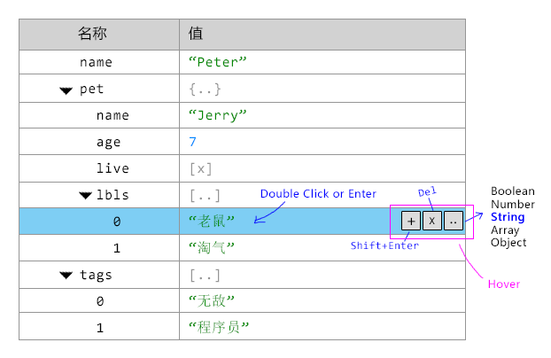

-------------------------------------------------------------------
# ObjJson Overview

`<ti-obj-json>` can:

- Edit any json object, event `Number|Boolean|String`
- It will support the value type:
  + `Object`
  + `Array`
  + `Number`
  + `Boolean`
  + `String`
  

The GUI base on `ti-tree` with one value field like:



-------------------------------------------------------------------
# Properties

## className

```js
"className" : null
```

## data

```js
"data" : null
```

Any valid json data will be allowed.

-------------------------------------------------------------------
# Tree Data

To render a tree, it will creat the tree data from a `PlainObject` like:

```js
{
  name  : "Array",
  value : "[..]",
  //--------------------------------------------
  // Indicate the name field value type, it could be:
  //  - Label : Readonly
  //  - Key   : Editable string key in Object
  //  - Index : Readonly integer key of Array
  nameType  : "Label",
  //--------------------------------------------
  // Indicate the value field render mode, it could be:
  //  - "Array"
  //  - "String"
  //  - "Integer"
  //  - "Float"
  //  - "Boolean"
  //  - "Nil"
  valueType : "Nil"
  childern : []
}
```

