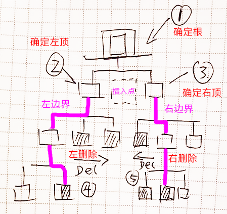
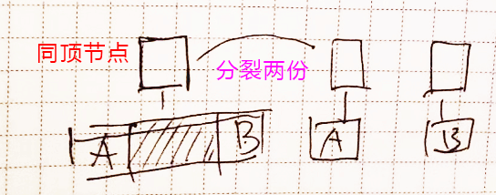

--------------------------------------
# 动机：为啥要设计这个算法

在富文本文档编辑时，如果用户选择一段文字，然后点击插入图片，或者其他的嵌入式对象。
选中的文字应该被替换成对应的图片或者对象。

但是文档树的选区是在一个树上做的选择，选区开始和结束的节点很可能不是同层节点。
譬如 `B,I,U,A,SPAN` 这样的节点互相嵌套就会导致这样的现像。跨越段落的选择，尤其容易如此。

因此随手写点判断似乎很难应对所有的情况，我们需要整理一个比较清晰的算法，否则以后维护代码容易要自己的小命。

--------------------------------------
# 计划应用场景

- 插入图片,视频，表格等嵌入式对象
- 选择文本设置颜色或者超链接

... 好像原生的 `Range` 就能满足这个需求 -_-!

--------------------------------------
# 算法描述

首先一个选区范围(`Range`)，我们称*开始节点*为`左节点`，*结束节点*为`右节点`。

## 异顶选区

从选区的`左节点`和`右节点`分别向上寻找，你总会找到一个它们共同的节点，
这个节点，我们称为`根`，而这个寻找的节点路径，我们分别称为`左边界`和`右边界`。

`边界`是节点的数组（反序，即第一个元素为`节点`本身），
那么边界的最后一个节点就是距离`根`最近的节点，我们称为`顶`。
因此，我们得到了`左顶`和`右顶`。

插入前，我们沿着`左边界`，清理其右侧的节点(`nextSibling`)。
然后沿着`右边界`清理其左侧的节点(`previousSibling`)
最后我们将插入的内容，放置`左顶`和`右顶`之间。

清理删除的元素，可以有下面几个选项：

1. 完全丢弃
2. 将文本内容设置给插入节点
3. 直接作为插入节点子孙节点

## 共顶选区

这是一个比较简单的情形。尤其是收缩的选区(`collapsed=true`)，肯定会导致 *"共顶"*。
因此，我们需要将这个`共顶`克隆一份，形成`左顶`和`右顶`。当然，克隆之后，还是要剪裁一下文本。

同时，也要考虑，如果无论是`左顶`还是`右顶`，如果其内最总没有内容，就没必要生成。

清理删除的文本，选项就变成了两个

1. 完全丢弃
2. 将文本内容设置给插入节点