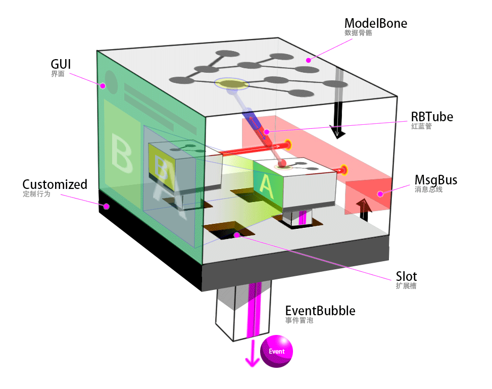

----------------------------------------------------
# 元素定义



> 任何一个 TiElement 均为 `ti.el.TiElement` 的实例。
> 可以用 `new ti.el.TiElement("ti.coll.table")` 创建实例 

```bash
ti/coll/table/              # 元素的主目录
    |-- i18n/               # 国际化
        |-- zh-cn.json      # 每个语言一个文件
        |-- ..              # 必须是标准的 JSON 文件
    |-- table.json          # 元素定义文件
    |-- table.css           # 元素的CSS文件（补充CSS，样式应该用全局）
    |-- table.html          # 元素的模板文件（Vue模板） 
    |-- table.js            # 主 js 文件
```

- `table.json` 符合[元素配置文件定义](co_ti_element_json.md)

----------------------------------------------------
# 定义文件的路由

----------------------------------------------------
# 元素实例·全局

----------------------------------------------------
# See Also