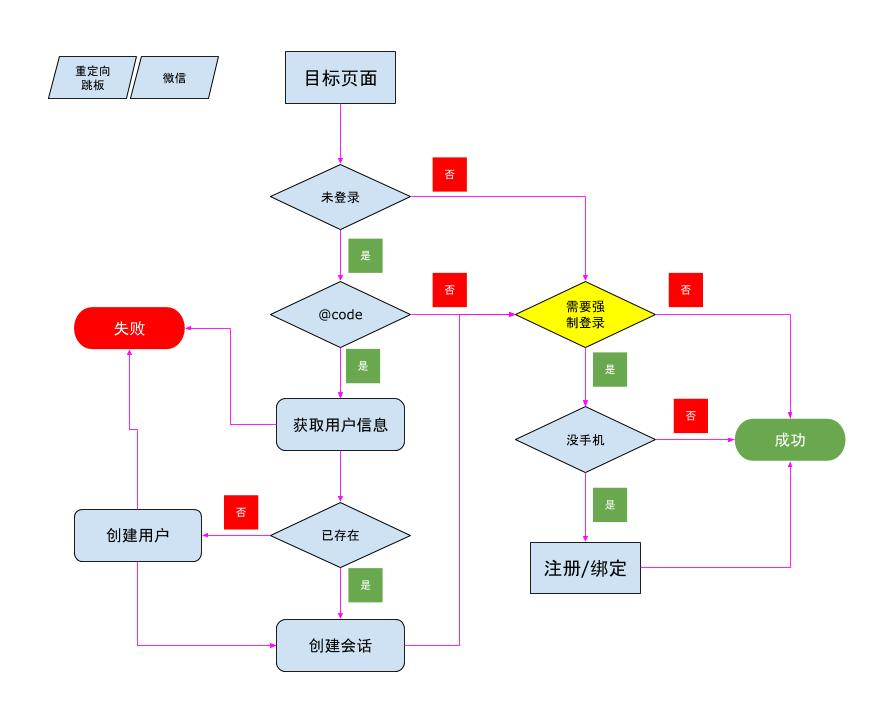

--------------------------------------------
# 域数据结构

在域中，需要有一个表存放所有的账号，以及一个目录存放 session

```bash
~/
  |-- .www/
  |    |-- session/   # 存放所有的站点会话
  |        |-- $SiteId/  # 每个站点一个目录
  |            |-- $TicketId  # 会话对象，名称是票据ID
  |-- accounts/       # ThingSet 账号库
  |-- roles/          # ThingSet 角色库
  |-- www/            # 站点目录
```

> 具体数据结构参看 [账号与授权·元数据](auth_meta.md)

--------------------------------------------
# 流程图



--------------------------------------------
# 页面保护代码

## wnml

> 在 `wnml` 可以这么写

```html
<if test="!API.checkMyPhone()">
  <redirect code="302" text="Found">
    <url>${URI_BASE}/login.wnml</url>
    <http-resp-header>
      <set-cookie>taph=${URI_PATH}; Path=${URI_BASE}/login.wnml;</set-cookie>
     </http-resp-header>
  </redirect>
</if>
```

- `API` 对象是上下文的一个调用接口 `WWWPageAPI`
- `checkMyPhone` 函数将会依次检查是否登录，以及用户是否有手机号
- `<url>` 表示要转移的路径
  + 如果是绝对路径，表示相对于站点的路径
  + 如果是相对路径，表示相对于当前的网址
- `<set-cookies>` 的 `taph` 记录一下完成登录后的目标页面
  + 这个 cookies 会在 `login.wnml` 时带上来，这样登录后就知道要跳转到那个页面了

## Vue

> 这个用 `.regapi` 来搞，稍后补充

--------------------------------------------
# 关于 Cookie

```bash
# 格式为 www=站点ID/会话票据
www=45tr..3we1/er43..23vd
```

通过 `www` 可以在 `~/.www/session/` 找到对应的 Session ID
