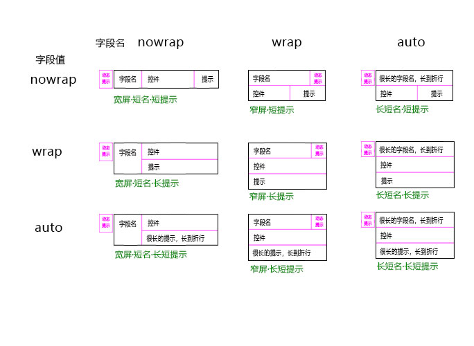

# 表单的DOM布局


## `mode=flat`

```bash
.ti-form-grid @ spacing | mode
#---------------------------
|-- [?] <header>
|   |   |-- [?] .title-icon
|   |   |-- [?] .title-text
#---------------------------
|-- <main>
|   |-- <section.flat-body>
|   |   #---------------------------
|   |   |-- <GridContainer ..>
|   |   #---------------------------
```

## `mode=group`

```bash
.ti-form-grid @ spacing | mode
#---------------------------
|-- [?] <header>
|   |   |-- [?] .title-icon
|   |   |-- [?] .title-text
#---------------------------
|-- <main>
|   |-- <section.group-body>
|   |   #-----------------------
|   |   |-- [?] <div.group-title>
|   |   |   |-- [?] .title-icon
|   |   |   |-- [?] .title-text
|   |   #-----------------------
|   |   |-- <GridContainer ..>
|   #---------------------------
|   |.. <section>
```

## `mode=tab`

```bash
.ti-form-grid @ spacing | mode
#---------------------------
|-- [?] <header>
|   |   |-- [?] .title-icon
|   |   |-- [?] .title-text
#---------------------------
|-- <main.tab-at-xxx>
|   #---------------------------
|   |-- <section.tab-head>
|   |   |-- <div.tab-head-item>
|   #---------------------------
|   |-- <section.tab-body>
|   |   |-- <GridContainer ..>
```

# 字段的DOM布局



```bash
.form-field(.is-name-nowrap .is-value-nowrap)
#---------------------------
|-- .field-name
|   |-- .field-name-con
|   |   |-- [?] .field-icon
|   |   |-- [?] .field-text
|   |   |-- [?] .field-required
#---------------------------
|-- .field-value
|   |-- .field-value-com
|   |   |-- <Component>
|   |-- .field-value-tip
#---------------------------
|-- .field-status
```


# 属性概要

**Data**

- `data`
- `fields`
- `fieldStatus`
- `onlyFields`
- `omitHiddenFields`
- `fixed`
- `lang`

**Behavior**

- `defaultFieldType`
- `defaultComType`
- `linkFields`
- `currentTab`
- `keepTabIndexBy`
- `autoShowBlank`
- `canCustomizedFields`
- `keepCustomizedTo`
- `whiteFields`
- `blackFields`
- `canSubmit`
- `actionButtonSetup`

**Aspect**

- `mode` : `flat|group|tab`
- `screenMode` : `desktop|tablet|phone`
- `tabAt`
- `tabBodyStyle`
- `fieldBorder`
- `fieldWrap`
- `fieldNameAlign`
- `fieldNameVAlign`
- `fieldNameClass`
- `fieldNameStyle`
- `fieldNameWrap`
- `fieldValueClass`
- `fieldValueStyle`
- `fieldValueWrap`
- `blankAs`
- `icon`
- `title`
- `statusIcons`
- `spacing`
- `actionSize`
- `actionAlign`
- `submitButton`
- `setupButton`
- `setupCleanButton`
- `customizeDialog`

**Measure**

- `fieldNameWidth`
- `gridColumnHint` 


# 属性详解

## `fieldNameWidth`

```js
// 固定宽度
{
  nameWidth : "1.2rem"  // 数字代表像素
}
// 根据语言不同，采用不同的宽度
{
  nameWidth : [
    // 英文界面
    ["1.5rem", "en-us"],
    // 默认
    [140]
  ]
}
```

## `fieldWrap`

```js
// 固定宽度
{
  nameWidth : "1.2rem"  // 数字代表像素
}
// 根据语言不同，采用不同的宽度
{
  nameWidth : [
    // 英文界面
    ["1.5rem", "en-us"],
    // 默认
    [140]
  ]
}
```

## `gridColumnHint`

```js
// 根据绘制区域大小决定
{
  gridColumnHint : [
    // 超过 1000 像素时，三列
    [3, 1000],
    // 超过 600 像素时，两列
    [2, 600],
    // 默认，一列
    [1],
  ]
}
// 根据屏幕模式决定
{
  gridColumnHint : [
    // 桌面三列
    [3, "desktop"],
    // 平板两列
    [2, "tablet"],
    // 手机一列
    [1, "phone"],
    // 默认一列
    [1]
  ]
}
```
