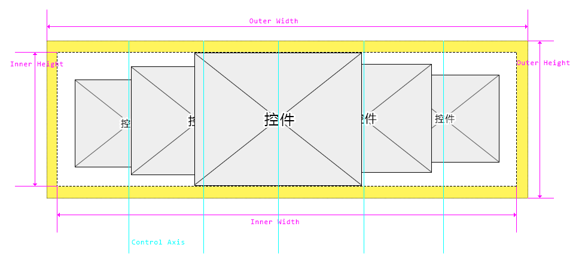
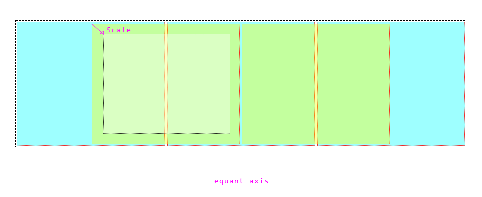

# 走廊概述

走廊将展示一组控件，让其具备灵动的鼠标交互效果。

本控件的重点是如何计算控件的位置:

计算的策略如下：

1. 控件中轴等分排布
2. 以距离中心点远近等比缩放控件
3. 鼠标移动将改变中心点

# 属性列表

| Name       | Description                                     |
| ---------- | ----------------------------------------------- |
| `items`    | 【数组】控件数据                                |
| `comType`  | 默认的控件类型                                  |
| `comConf`  | 默认的控件配置                                  |
| `width`    | 整体宽度（外部宽度）                            |
| `height`   | 整体高度（外部高度）                            |
| `minScale` | 最小缩放比例，是一个 `0-1` 的浮点数，默认 `0.5` |

