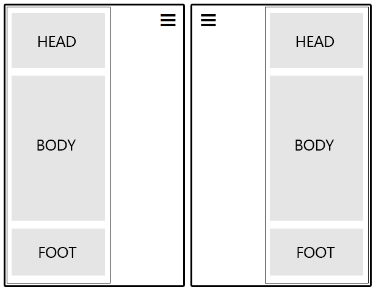

# 图标弹出搁板概述

点击一个图标，屏幕全局弹出一个一个搁板，可以嵌入两个组件。

> 主要为移动设备界面设计

# 属性列表

 Name       | Description
------------|-------------------
`icon`      | 显示图标
`closeIcon` | 关闭按钮图标
`mode`      | 显示模式：左展开，右展开
`head`      | 头部控件
`body`      | 主体控件
`foot`      | 底部控件
`width`     | 展开搁板宽度
