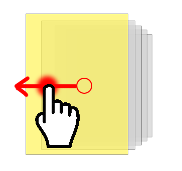

# 滚动卡片

走廊将展示一组控件叠加控件，滑动翻动下一张。无尽循环翻动

计算的策略如下：

1. 控件中轴等分排布
2. 以距离中心点远近等比缩放控件
3. 鼠标移动将改变中心点

# 属性列表

| Name           | Description                                     |
| -------------- | ----------------------------------------------- |
| `data`         | 【数组】控件数据                                 |
| `currentIndex` | 默认高亮卡片下标                                 |
| `idBy`         | 数据用什么键标识 ID                              |
| `comType`      | 默认的控件类型                                   |
| `comConf`      | 默认的控件配置                                   |
| `cardScale`    | 卡片宽高比                                       |
| `cardWidth`    | 卡片宽                                          |
| `cardHeight`   | 卡片高                                          |
| `cardDiffX`    | 卡片X轴叠放差值                                  |
| `cardDiffY`    | 卡片Y轴叠放差值                                  |
  
